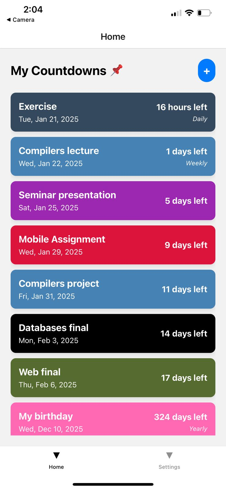
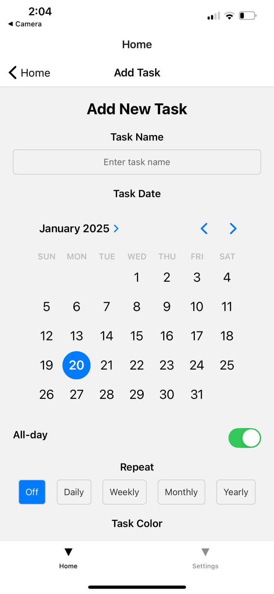
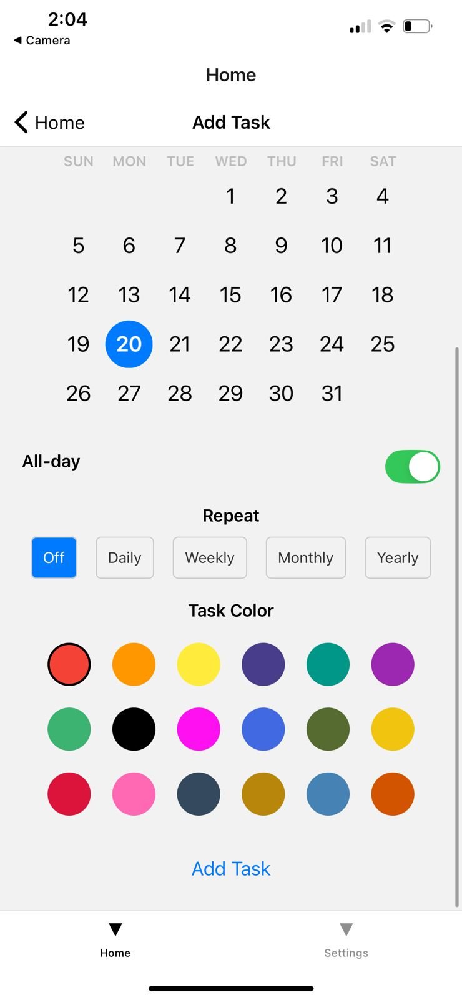
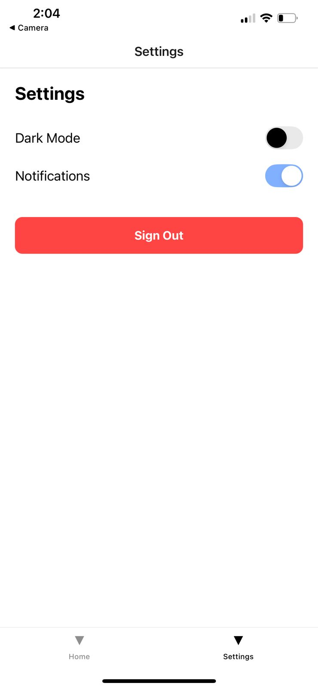

# ⏳ Countdown & Event Manager
*By Khaled Alharbi*

---

## 📖 Overview  
**Countdown & Event Manager** is a mobile application designed to help users track and manage upcoming events with ease.
Users can create personalized countdowns for birthdays, deadlines, appointments, and more, while receiving timely notifications to stay on top of their schedule.

The application integrates Firebase Authentication for secure sign up and login, Firebase Database for storing countdown events, and Expo Notifications to alert users about upcoming events.   
Navigation features like bottom tabs and stacked views provide a smooth and intuitive experience.

---

## 🛒 Features  

### User Experience  
- Sign up and log in with Firebase Authentication
- Create, edit, and delete events
- Set personalized countdown timers for each event
- Store countdown events in Firebase Database
- Receive notifications before events
- Bottom tab navigation for quick access to main sections
- Stacked views for detailed event information
- Clean and responsive mobile UI

### Notifications
- Push notifications powered by Expo
- Configurable reminders for upcoming events
- Real-time updates on countdown changes

---

## 🛠 Tech Stack  
- **Frontend:** React Native
- **Backend:** Firebase BaaS
- **Notifications:** Expo Notifications-
- **Navigation:** React Navigation (Bottom Tabs & Stack Navigator)
---

## Setup Notes  
To run the backend correctly, make sure to complete the following steps:

#### 1. Install required software
Before running the project, ensure you have:  
a. Node.js  
b. Expo CLI  
c. Firebase account for authentication and database  

#### 2. Configure Firebase
- Create a Firebase project
- Enable Email/Password Authentication
- Set up Firestore Database or Realtime Database to store countdown events
- Copy the Firebase config object into the `App.js` file in the project

#### 3. Install dependencies  
Inside the project folder, run:
```
npm install
```
This will install all required Node modules before running the server.


#### 4. Start the application
Run the Expo development server:
```
expo start
```
Scan the QR code displayed in the terminal using the Expo Go app on your phone.

---

## 📷 Screenshots  

<p align="center">
  
  
</p>

<p align="center">
  
  
</p>

---

## 📜 Credits  
Developed by:   
- **Khaled Alharbi**  


